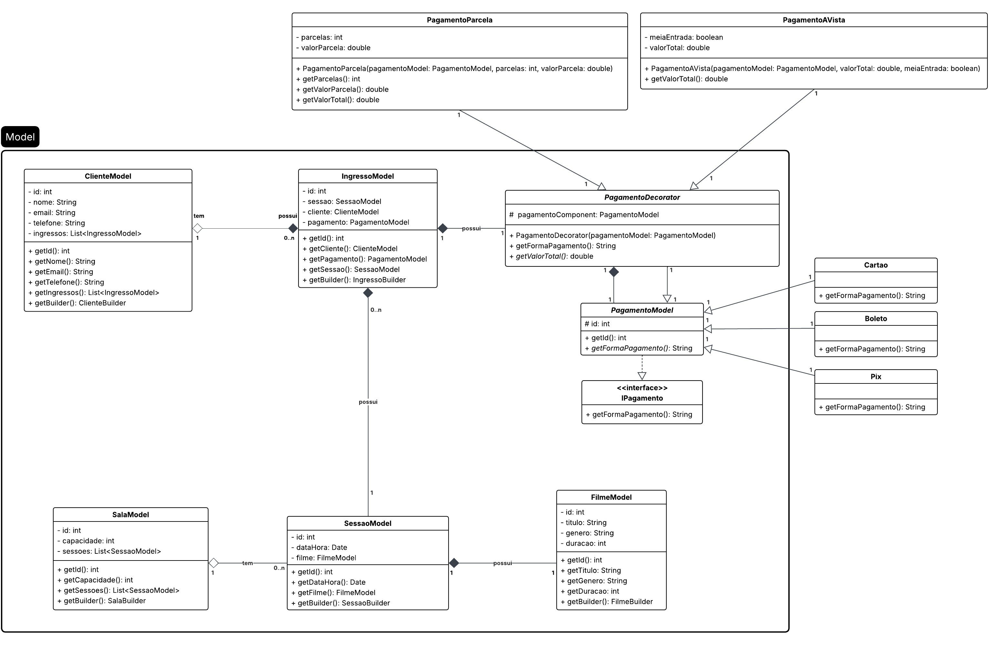

# 🎬 CinePlus

Sistema web para gestão de cinema: cadastro de clientes, filmes, salas, sessões e venda de ingressos com registro de pagamentos.
Projeto acadêmico desenvolvido no contexto da disciplina de **Padrões de Projetos**, aplicando padrões estruturais e comportamentais em uma aplicação Java EE (Servlet + JSP + MySQL).


---

## ✨ Funcionalidades

- 👤 **Clientes** — cadastro, listagem, edição e exclusão.
- 🎞️ **Filmes** — cadastro e vínculo com sessões.
- 🏟️ **Salas** — capacidade e associação com sessões.
- 📅 **Sessões** — data/hora, filme associado e consulta de vagas disponíveis.
- 🎟️ **Ingressos** — emissão vinculando cliente, sessão e forma de pagamento.
- 💳 **Pagamentos** — abstração por interface e implementações (cartão, boleto, PIX etc.), com uso de **Builder** para montagem dos objetos de pagamento.

---

## 🛠️ Stack tecnológica

| Tecnologia | Uso                           |
|------------|-------------------------------|
| Java 24 | Linguagem Back-End principal |
| Maven | Build e empacotamento WAR     |
| JavaX Servlet API / JSP | Camada web                    |
| MySQL | Banco de dados relacional     |

---

## 🏗️ Arquitetura e padrões

- **Command** — cada operação (por exemplo `ClienteCadastrar`, `FilmeConsultarTodos`) implementa [`ICommand`](src/java/command/ICommand.java) em pacotes por domínio (`command.cliente`, `command.filme`, …);
- **DAO** — acesso a banco de dados em [`dao`](src/java/dao);
- **MVC** — segmentação entre entidades e manipulação de dados e abstração de lógicas de negócio da interface de usuário, com controle de servlet único através do [`Controller`](src/java/controller/Controller.java) mapeado em `/controle`, que despacha para comandos via parâmetros `model` e `op`;
- **Strategy** — alteração de ação sem afetar seu uso ([`IPagamento`](src/java/model/pagamento/IPagamento.java));
- **Builder** — classes Builder internos que simplificam o instanciamento de classes de modelo ([`PagamentoBuilder`](src/java/model/pagamento/PagamentoBuilder.java));
- **Factory** — unificação do `Controller` por parâmetros de especificação do modelo e da ação de acordo com o nome de suas classes Command;
  53399517d2369805a9292662459a725b33873ad7- **Decorator** — separação modular dos objetos de `Pagamento` em tipos (`PagamentoAVista` e `PagamentoParcelado`) e formas de pagamento (`Pix`, `Boleto`, `Cartao`) sem a necessidade de criar todas as suas combinações possíveis (explosão de classes). 



Fluxo típico de requisição: navegador → `/controle?model=Cliente&op=ConsultarTodos` → instanciação reflexa do comando *ClienteConsultarTodos* → JSP de destino *listaClientes.jsp*.

---

## 📋 Dependências

- [JDK 24](https://openjdk.org/) (ou ajuste no `pom.xml`).
- [Maven 3.x](https://maven.apache.org/).
- [MySQL](https://dev.mysql.com/) em execução (porta padrão `3306`).
- Servidor de aplicação compatível com **Servlet 4** (ex.: Tomcat 9).

---

## 🗄️ Banco de dados

1. Execute o script `sql/cineplus_schema.sql` no MySQL Workbench.
2. Ajuste credenciais em `FabricaConexao.java` se necessário:
    - URL: `jdbc:mysql://localhost:3306/db_cineplus`
    - Usuário: `root`
    - Senha: *(vazia por padrão)*

---

## 🚀 Build e deploy

No diretório do projeto (onde está o `pom.xml`):

```bash
mvn clean package
```

O artefato gerado é `target/CinePlus.war`. Copie-o para o diretório `webapps` do Tomcat (ou faça o deploy pela interface de administração do servidor).

É recomendada a utilização da IDE IntelliJ IDEA com a extensão **Tomcat and TomEE** ou **SmartTomcat**.

### Como acessar

Após o deploy com contexto `/CinePlus`:

- URL base: `http://localhost:8080/CinePlus/`
- O [`index.html`](web/index.html) redireciona para `/CinePlus/controle` (Front Controller).

Parâmetros usados pela controller:

- **`model`** — nome da entidade (`Cliente`, `Filme`, `Ingresso`, `Sala`, `Sessao`).
- **`op`** — ação (por exemplo `Cadastrar`, `ConsultarTodos`, `Atualizar`, `Deletar`, `ConsultarId` ou `ConsultarCadastro` quando existir).


## Licença

Uso educacional. Todos os direitos reservados para os autores.